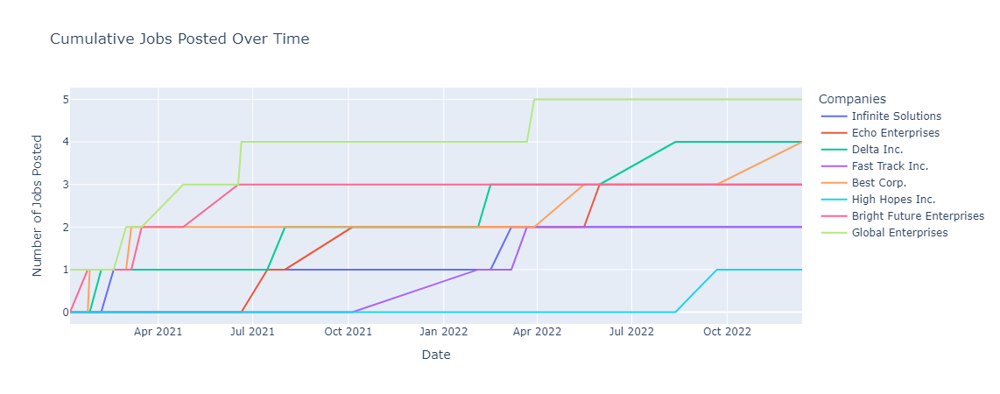

# GOhiring Data Team Code Challenge
## Data Cleaning
### Jobs
- 2 rows were dropped where `price` was `null`.
- Duplicate rows were dropped.
- Fixed spelling errors in `state` column.
- Converted `posted_at` datetime str type column to date.
- Added a new column for `month` and `year` extracted from `posted_at` column.
- Price rounded to 2 decimal places.
- Wrote cleaned data to `jobs.parquet`.

### Companies
- Converted dictionary of dictionaries to a list of dictionaries.
- Converted Unix timestamp to human-readable date.
- Renamed columns to match `jobs` column name convention.
- Wrote cleaned data to `companies.parquet`.

## Observations
- Some zip codes are not real, but I then realised - neither is King's Landing.
- There is no job data available for `Jumpstart Corp.`.
- The `establishment dates` of companies do not correspond to the `posted_at` dates of jobs.
- Job `id` is provided but no job descriptions.
- `expired_at` is not provided but would be useful to understand job durations.
- `Infinite Solutions` has a large standard deviation in job prices. The standard deviation is more than double the average price. Other companies have more consistent pricing with the standard deviation being less than the mean.

## Answers

### 1. What location has the most jobs that are either posted or expired?
The location with the most jobs that are either posted or expired is `Tarth` with `15 jobs`.

### 2. What month had the most cancelled jobs?
The month with the most cancelled jobs is `June 2021` with `5 jobs`.

### 3. Which company has the highest ratio of posted jobs to employee count?
The company with the highest ratio of posted jobs to employee count is `Best Corp.` with a ratio of `0.0175`.

### 4. Develop the SQL to define a dimensional model schema for this data. Document (or be ready to discuss) any design decisions that you make.
1. Company Dimension Table
```sql
CREATE TABLE dim_company
(
    company_id INT PRIMARY KEY,
    company_name VARCHAR(255),
    establishment_date DATE,
    number_of_employees INT
);
```

2. Location Dimension Table
```sql
CREATE TABLE dim_location
(
    zip_code INT PRIMARY KEY,
    location VARCHAR(255)
);
```

3. Job Fact Table
```sql
CREATE TABLE jobs
(
    id INT PRIMARY KEY,
    state VARCHAR(255),
    price FLOAT,
    company_id INT,
    date DATE,
    month SMALLINT,
    year INT,
    zip_code INT,
    FOREIGN KEY (company_id) REFERENCES dim_company(company_id),
    FOREIGN KEY (zip_code) REFERENCES dim_location(zip_code)
);
```

- Design Considerations
    - Primary Keys: Each table has a primary key (company_id, zip_code, and id for the fact table), which uniquely identifies a row within those tables.

    - Foreign Keys in Fact Table: The fact_transaction table includes foreign keys to dim_company and dim_location. This enforces referential integrity between the transactions and companies/locations involved. It allows the fact table to remain lean and optimized for queries that join on these dimensions for descriptive analysis.

    - Normalization: The schema shows a normalized form to avoid redundancy and ensure data integrity. This is particularly important for the company and location information, which might relate to many transactions.

    - Granularity: The fact table's granularity is at the individual transaction level, containing foreign keys back to the dimension tables for descriptive attributes.

    - Month and Year Columns: Including month and year as separate columns in the fact_transaction table can speed up queries that aggregate data by these time units without requiring extraction from the date column.

- Additional Considerations (Not Implemented)
    - Job Description: The job description is not included in the schema. If this information is needed for analysis, it could be stored in a separate table linked to the fact table by a foreign key.

    - Keys and Indexes: The schema does not include keys or indexes for performance optimization. Depending on the database system and query patterns, these could be added to improve query performance.

### 5. Using your dimensional model, write a SQL query that returns a list of jobs for each company, ordered and enumerated within each group by the `posted_at` date.
```sql
WITH OrderedJobs AS (
  SELECT
    j.id AS job_id,
    c.company_name,
    j.date AS posted_date,
    ROW_NUMBER() OVER(PARTITION BY j.company_id ORDER BY j.date) AS job_sequence_number
  FROM jobs j
  JOIN dim_company c ON j.company_id = c.company_id
)

SELECT *
FROM OrderedJobs
ORDER BY company_name, posted_date;
```

### 6. Discuss how you would obtain and model information (within your schema) about the duration of jobs (from posted to expired states).

The schema currently contains `date` which is referring to the date at which the job was posted. To model the duration of jobs, we could add a new column to the fact table called `expired_at`. When a new job listing is captured, both the start (posting) and end (expiration) points should be recorded.

Using the newly added `expired_at` field, we can calculate the difference between the `posted_at` and `expired_at` dates. This would allow us to analyze the length of time jobs are active and identify trends or patterns in job duration.

### 7. Provide a visualization showing the trend of the number of active jobs over time. Also include the company name data in this visualization.


#### Comments on Results
- The number of posted jobs fluctuates over time, with some companies like `Delta Inc.` consistently posting new jobs while others have more sporadic activity.
- `Global Enterprises` has the highest number of posted jobs. This could be due to the company's size with the company having the highest number of employees compared to others. 
- `Best Corp.` has a high ratio of posted jobs to employee count, indicating a high level of job postings relative to the company's size. However, they do offer the lowest prices on average for their job listings. 
- `High Hopes Inc.` posted only one job since its establishment. 